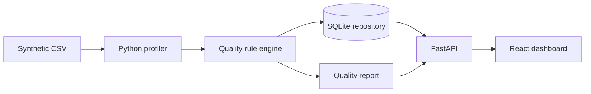

# DataTrust — Enterprise Data Quality & Metadata Platform

DataTrust is a portfolio-scale version of the internal tooling an enterprise data team might use to answer a deceptively simple question: **can people trust this dataset, and can we prove why?**

It profiles incoming records, runs configurable quality controls, documents business and technical metadata, traces source-to-target movement, and keeps scan evidence in a relational repository. The dashboard turns that evidence into something a data designer, business analyst, steward, or control owner can review without reading raw logs.

> All records in this repository are synthetic. The project is not affiliated with a bank and contains no real customer information.

## Why I built it

Many portfolio projects stop at visual reporting. I wanted to work through the earlier parts of the data lifecycle too: defining what a field means, mapping it from source to target, measuring quality, recording failures, understanding downstream impact, and making the result auditable.

## What the project demonstrates

- Data profiling for completeness, distinct values, inferred types, and null detection
- Configurable rules across completeness, uniqueness, validity, accuracy, and conformity
- Logical and physical relational data models for assets, metadata, rules, scans, results, mappings, lineage, and audit events
- Business glossary, data dictionary, ownership, classification, and stewardship metadata
- Field-level source-to-target mapping with transformation and validation logic
- End-to-end data lineage and downstream impact context
- Python automation, Pandas, SQL, SQLite, FastAPI, React, and TypeScript
- Unit testing, requirements traceability, technical specifications, and CI

## Architecture



More detail is available in [the architecture document](docs/ARCHITECTURE.md).

## Repository map

```text
app/                         React and TypeScript dashboard
backend/api.py               FastAPI service
backend/quality_engine.py    Profiling, rules, scoring, and persistence
backend/config/              Externalized quality rules
backend/sql/                 Physical SQLite schema
backend/metadata/            Dictionary, glossary, mappings, and lineage
backend/tests/               Automated quality-engine tests
data/                        Synthetic input data with controlled defects
docs/                        Architecture, specification, and traceability
```

## Run the data pipeline

Create a Python environment and install the backend dependencies:

```bash
python -m venv .venv
source .venv/bin/activate        # Windows: .venv\Scripts\activate
pip install -r backend/requirements.txt
python -m backend.run_pipeline
```

The command profiles `data/sample_customers.csv`, evaluates six rules, creates `backend/runtime/datatrust.db`, and writes the latest JSON report.

Start the API:

```bash
uvicorn backend.api:app --reload
```

Useful endpoints include `/api/profile`, `/api/metadata`, `/api/lineage`, `/api/reports/latest`, and `POST /api/scans`.

## Run the dashboard

```bash
npm install
npm run dev
```

Open the local address shown in the terminal. The prototype includes working navigation for Overview, Data Catalog, Lineage, Quality Rules, Mappings, and Reports.

## Tests

```bash
python -m unittest discover -s backend/tests -v
npm run build
```

The backend tests verify that the controlled defects are detected and that scan evidence is persisted. The frontend build verifies the production artifact.

## Sample quality findings

The synthetic file intentionally includes a blank identifier, duplicate identifiers, an invalid email, a missing birth date, an out-of-range credit score, and an invalid province code. Keeping known defects in the sample makes the rule results easy to verify during a demo.

## Documentation

- [Architecture](docs/ARCHITECTURE.md)
- [Technical specification](docs/TECHNICAL_SPECIFICATION.md)
- [Requirements traceability](docs/REQUIREMENTS_TRACEABILITY.md)
- [Data dictionary](backend/metadata/data_dictionary.json)
- [Source-to-target mapping](backend/metadata/source_to_target_mapping.csv)

## Next improvements

- Add Azure Blob Storage and an Azure Databricks notebook as an optional cloud execution path
- Replace the local metadata repository with PostgreSQL for multi-user deployments
- Add authentication and role-based access for owners, stewards, and technical users
- Add downloadable PDF and Excel report generation from scan evidence

The current version stays intentionally small enough to run locally and explain clearly in an interview, while still covering the full metadata and data-quality lifecycle.
