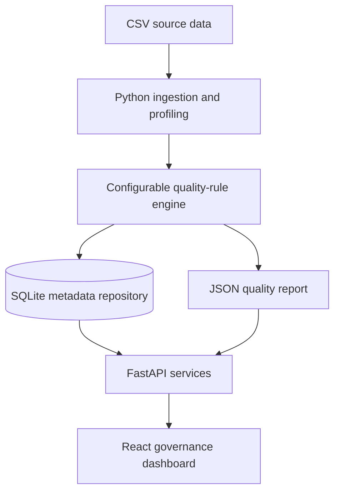

# DataTrust architecture

DataTrust is split into four deliberately small layers so every part can be discussed and tested independently.

## Responsibilities

| Layer | Responsibility | Evidence in this repository |
| --- | --- | --- |
| Ingestion | Read source data and preserve row-level evidence | `backend/quality_engine.py` |
| Quality controls | Execute configurable completeness, validity, uniqueness, accuracy, and conformity rules | `backend/config/quality_rules.json` |
| Metadata repository | Store assets, column profiles, scans, results, mappings, lineage, and audit events | `backend/sql/schema.sql` |
| API | Expose profiles, metadata, lineage, latest reports, and scan execution | `backend/api.py` |
| Experience | Present catalog, lineage, rules, mappings, audit history, and quality metrics | `app/page.tsx` |

The included records are synthetic and intentionally contain controlled defects. No real customer or bank data is used.
